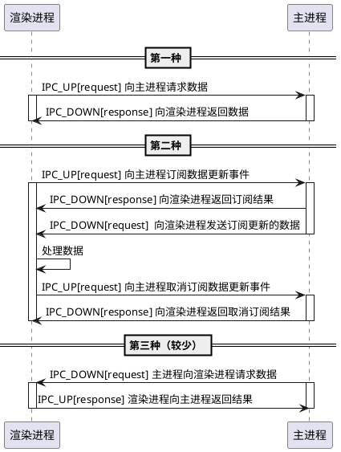
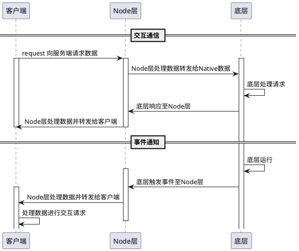

# 通信模型

## 原始Electron

```plantuml
@startuml event

participant 渲染进程 as GUI
participant 主进程 as Main

== 第一种 ==
GUI -> Main: IPC_UP[request] 向主进程请求数据
activate Main
activate GUI
Main -> GUI: IPC_DOWN[response] 向渲染进程返回数据
deactivate Main
deactivate GUI

== 第二种 ==
GUI -> Main: IPC_UP[request] 向主进程订阅数据更新事件
activate Main
activate GUI
Main -> GUI: IPC_DOWN[response] 向渲染进程返回订阅结果
Main -> GUI: IPC_DOWN[request]  向渲染进程发送订阅更新的数据
deactivate Main
GUI -> GUI: 处理数据
GUI -> Main: IPC_UP[request] 向主进程取消订阅数据更新事件
activate Main
Main -> GUI: IPC_DOWN[response] 向渲染进程返回取消订阅结果
deactivate Main
deactivate GUI

== 第三种（较少） ==
Main -> GUI: IPC_DOWN[request] 主进程向渲染进程请求数据
activate Main
activate GUI
GUI -> Main: IPC_UP[response] 渲染进程向主进程返回结果
deactivate Main
deactivate GUI
@enduml
```

## Yukihana

Yukihana不是与Electron层进行通信，而是直接与底层进行通信，因此，通信流程大大简化。

```plantuml
@startuml event

participant 客户端 as Bot
participant Node层 as Node
participant 底层 as Native

== 交互通信 ==
Bot -> Node: request 向服务端请求数据
activate Bot
activate Node
activate Native
Node -> Native: Node层处理数据转发给Native数据
Native -> Native: 底层处理请求
Native -> Node: 底层响应至Node层
Node -> Bot: Node层处理数据并转发给客户端
deactivate Bot
deactivate Node

== 事件通知 ==
Native -> Native: 底层运行
activate Node
Native -> Node: 底层触发事件至Node层
activate Bot
Node -> Bot: Node层处理数据并转发给客户端
Bot -> Bot: 处理数据进行交互请求
deactivate Node
@enduml
```
