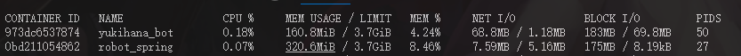
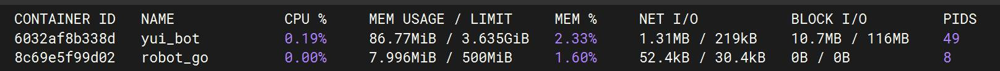

# 简介

本文档将国内流行即时聊天工具简称为 Telecord。

Yui 基于 IM 底层能力实现，直接使用 `nodejs` 运行，从根本剔除 `Electron` UI 层依赖，属于**真正的无头服务**。

> Telecord
> 
> Telegram + Discord => Telecord

## 通信模型

Yui 当前以正向 WebSocket 作为主要动作调用入口，并通过 HTTP 提供文件相关辅助接口。

通信结构参考 OneBot，但并不完全等同，实际字段以本项目文档与源码为准。

## 当前能力范围

- 账号域：扫码登录、账号密码登录、快速登录、查询登录状态与账号列表
- 好友域：好友列表、好友资料、点赞好友
- 群域：群列表、群资料、群成员资料、戳一戳、群消息列表
- 消息域：发送消息、发送合并转发、撤回消息、点赞消息

## 占用情况

### Electron Hook实现

### 直接调用底层实现

