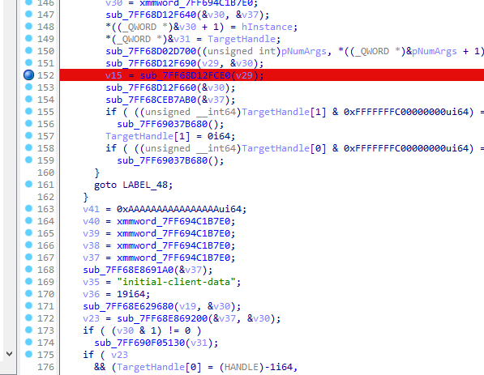
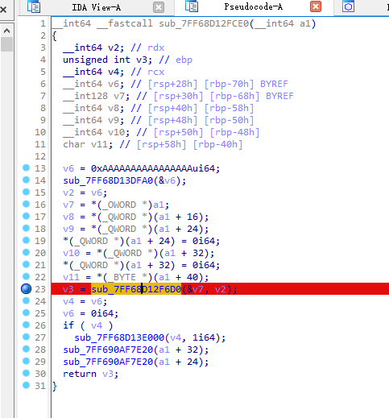
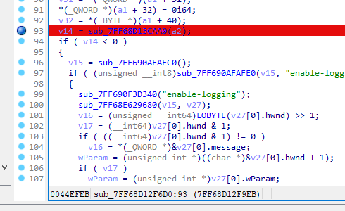
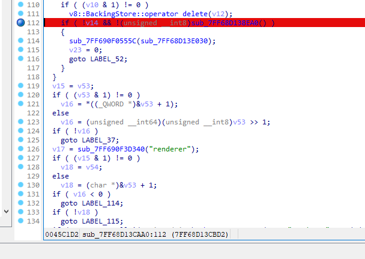
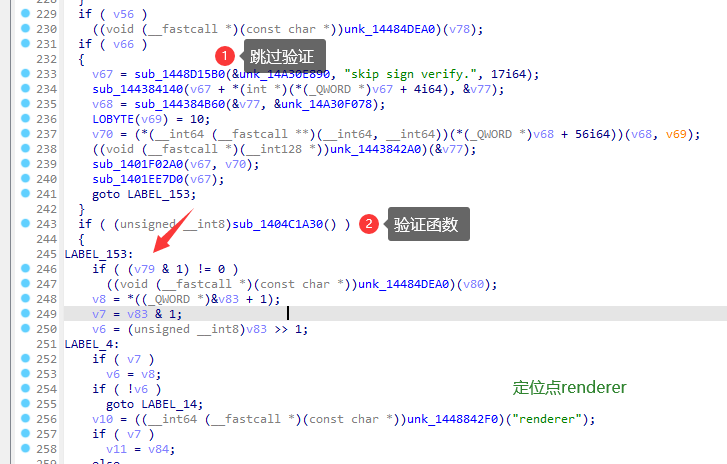
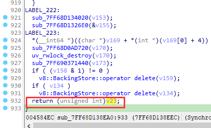

# Patch

阁下也可以参考此处：[QQNTFileVerifyPatch](https://github.com/LiteLoaderQQNT/QQNTFileVerifyPatch)

## 使用IDA打开启动文件

### 1. 进入main函数，找到如下位置点进去：

可使用 `initial-client-data` 做定位

### 2. 点进断点位置

### 3. 点进断点位置

可使用 `enable-logging` 做定位

### 4. 点进断点位置

可使用 `renderer` 做定位

旧的版本：

新的版本：

### 5. 找到返回处

进入验证函数，将 `return xxx` 改成 `return 1`

## 9.9.3

`E8 9A C1 DC 03 89 E8 0F 28 B4 24 40 04` -> `E8 9A C1 DC 03 B0 01 0F 28 B4 24 40 04`

## 9.9.5

`E8 BA CF DC 03 89 E8 0F 28 B4 24 40 04` -> `E8 BA CF DC 03 B0 01 0F 28 B4 24 40 04`

## 9.9.6

`DC 03 89 E8 0F 28 B4 24 40 04` -> `DC 03 B0 01 0F 28 B4 24 40 04`

## 9.9.7

9.9.7-20979: `38 04 89 E8 0F 28 B4 24 50 04` -> `38 04 B0 01 0F 28 B4 24 50 04`

9.9.7-21173: `38 04 89 E8 0F 28 B4 24 60 04` -> `38 04 B0 01 0F 28 B4 24 60 04`

9.9.9-22868: `38 04 89 E8 0F 28 B4 24 60 04` -> `38 04 B0 01 0F 28 B4 24 60 04`